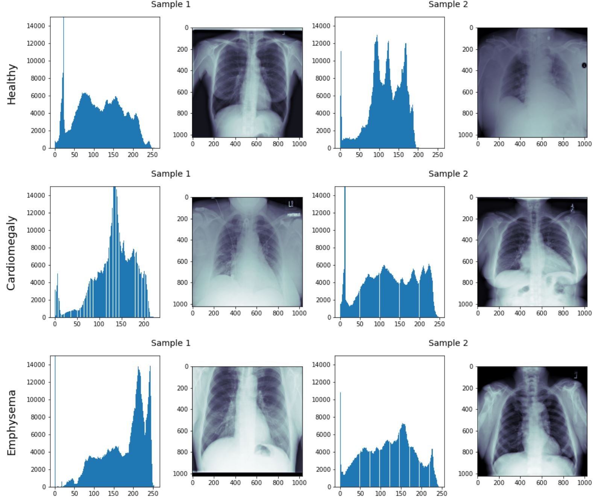

# Pneumonia-Udacity
This is the first project in fulfilment of the **AI for Healthcare** *Udacity Nanodegree*. The project uses chest X-ray images and includes data processing and EDA, building a diagnostic model in keras, and inspecting FDA proposal requirements.   

## Dataset
Chest X-ray images are provided by [Kaggle](https://www.kaggle.com/nih-chest-xrays/data) which contains more than 112k files for over 30k patients. The labels have been produced by NLP with more than 90% accuracy and include diseases such as Pneumonia, Infiltration, Edema, Mass, Cardiomegaly, etc and their comorbid.

## Project Phases
### Phase 1: EDA
[Data analysis](EDA.ipynb) is performed in jupyter notebook using mainly *pandas* package to address the following points:
-	The patient demographic data such as gender, age, etc.
-	The x-ray views or view position.
-	Sorting cases based on pneumonia and non- pneumonia
-	The distribution of other diseases that are comorbid with pneumonia
-	Number of diseases per patient
-	Histogram analysis of the imaging data for healthy & disease states of interest and compare distributions across diseases.

<figure>
  

  
  

  <figcaption>
 Pixel-level assessment of X-ray images 
</figcaption>
</figure>

### Phase 2: Building and Training the Model
All the following procedures  are implemented in [Build and train model](Build_and_train_model.ipynb).
#### Data processing
This starts with curating data according to EDA performed. First, each case is assigned with a pneumonia status label (binary value indicating whether pneumonia is diagnosed in the image). 
Train and test dataset are created by taking into account the data demographic distribution in either dataset. The train dataset is composed on 50% positive pneumonia cases while the test dataset consists of 20% positive pneumonia cases to reflect real-life pneumonia case rates.

#### Image preprocessing
To improve the training, image augmentation is applied by adding shear, flips, etc. Moreover, a costume function is defined to initially crop the center to focus on the lung region. This allows for better image processing by eliminating tons of redundant information that would be extracted from unnecessary and irrelevant body parts such as arms and abdomen. The image is later normalized and standardized using mean=[0.485, 0.456, 0.406], std=[0.229, 0.224, 0.225] which are the recommended values for VGG model.

#### Model definition
Using *transfer learning* technique, VGG16 model is loaded and last layer is tunned to specifically classify pneumonia data. Since this is a binary classification, loss and metric functions are set to *binary cross-entropy* and *binary accuracy*. 

Adam optimizer is chosen with initial learning rate () of 0.001 and . the learning rate is set to decrease 10-fold upon 5 unchanged validation loss down to . *Early stopping* criteria is set if no change is observed in validation loss after 12 attempts. Training is performed with 100 epochs and batch size of 32.

The hyperparameters values have been set after several trails. Some of the attempts with different values are presented in the notebook file.

Model evaluation parameters including *AUC* plot, *recall*, *precision*, and *accuracy* have been computed and the optimum classification threshold is found according to the maximum attained *F1* value.

### Phase 3: Testing & Postprocessing
The [Inference](Inference.ipynb) file is prepared to assess the model performance on 6 new, unseen X-ray  images. The code starts with reading the DICOM file followed by applying the preprocessing functions used in model training. The processed data are then fed to the model saved in training section to predict the presence of pneumonia. The result along with some info such as patient age and the assigned label are printed for conclusion.

**A note on prediction:** check_dicom method reads the important data form DICOM file and compare it with the algorithm requirements such as age, scanned body part, and patient position. If any of the aforementioned requirements differ from the model’s predetermined values, instead of rejecting prediction, a warning message will be included in the final report indicating the discrepancy. To compare the result, *Study Description* from DICOM file is also printed.

### Phase 4: FDA Report
A sample proposal is prepared based on FDA requirements that include model descriptions and results. Following points mentioned in [Udacity Project Description](https://github.com/udacity/AIHCND_C2_Starter/blob/master/README.md#4-fda--submission) have been considered in the [Report](SampleFDAreport.pdf):

**1. General Information**
  - Intended Use statement for the model
  - Indications for use that include target population and when the device could be utilized within a clinical workflow
  - Device limitations, including diseases/conditions/abnormalities for which the device has been found ineffective and should not be used
  - The impact of false positive or false negative on a patient

**2. Algorithm Design and Function**

   The fully trained algorithm is described along with the DICOM header checks based on which the model is built. The presented flowchart describes the following:
   *	Pre-algorithm performed on DICOM files
   *	Preprocessing steps performed by the algorithm on the original images (e.g. normalization)
   *	The architecture of the classifier

**3. Algorithm Training**

   Following parameters of the algorithm and how they were chosen are explained:
   *	Types of augmentation used during training
   *	Batch size
   *	Optimizer learning rate
   *	Layers of pre-existing architecture that were frozen
   *	Layers of pre-existing architecture that were fine-tuned
   *	Layers added to pre-existing architecture

   Moreover, the behavior of the *training loss* and *validation loss* are presented. Final algorithm's performance after training was complete, is evaluated by a precision-recall curve on the validation set. Finally, the threshold for classification corresponding *F1* score, recall, and precision are reported.

**4. Databases**

   Presenting information of patient in the database (including the training and validation datasets that are curated separately) as follows:
   *	Size of the dataset
   *	The number of positive cases and the its radio to the number of negative cases
   *	The patient demographic data (as it is available)
   *	The radiologic techniques used and views taken
   *	The co-occurrence frequencies of pneumonia with other diseases and findings

**5. Ground Truth**

   Exploring the benefits and limitations of the type of ground truth provided by NIH dataset.

**6. FDA Validation Plan**

   Following factors concerned with FDA Validation Plan are described:
   *	Information of the patient population for imaging data such as *age* ranges, *sex*, type of *imaging modality*, *body part* imaged, *prevalence* of disease of interest,  and any other diseases that should be included or excluded as comorbidities in the population
   *	Optimal ground truth determination
   *	Selecting the performance standard 
